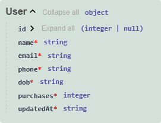

# Available endpoints and methods
## /users
### GET
Returns all users from database
### POST
Creates new user
### PATCH
Updates user, send id in body
## /users/id
### DELETE
Removes users with selected id

## /login
### POST
Recieves email and passowrd, and verifys the user, returns a JWT

# Request content
**GET** method requires authorization

**PATCH** and **DELETE** are still missing authorization

## Schema



### Example request for the post method:
```
{
    "name": "Rainer Roiner",
    "email": "rainer.roiner5@test.com",
    "phone": "11887744235",
    "dob": "1993-01-01T00:00:00Z",
    "purchases": 3948,
    "updatedAt": "2025-01-30T11:50:07.975000Z"
}
```
# Responses
**GET** returns an array of user objects

**POST** returns the created user object

**PATCH** returns simple "User updated" string

**DELETE** returns simple "User deleted" string

# DATABASE
Every user has a "user" role by default. If the role needs to be updated to "admin", it needs to be changes manually in the database. 
Every field is mandatory, except for the number of purchases.
Inside of address and data anyhting can be stored, amount doesn't matter. 
- Details like gender and taste preferences can be stored in **data**.
- Details like street name nad zipcode can be stores in **address**.

```
table USER
  id        Int     @id @default(autoincrement())
  name      String  
  password  String   @default("hashed-pass")
  email     String   @unique
  role      String   @default("user")
  phone     String   @unique 
  dob       DateTime
  purchases Int?     
  address   Json     @default("{}")  
  data      Json     @default("{}")  
  createdAt DateTime @default(now())
  updatedAt DateTime @updatedAt
```

## JWT example
```
{
    "sub": "1234567890", - user id

    "name": "John Doe", - name of user

    "email": "john.doe@example.com", - email of user

    "role": "user", - role of user

    "exp": 1739659869 - token expiry time (utc, since unix epoch)
}
```

# WORKDISTRIBUTION and to-do list

- MINERVA - fastAPI, Create login endpoint, (optionally github login)
- ELLEN - middleware authorization jwt
- IRIS - db connection och prisma schema, env (kan sättas i rahi2     users-service-api) (db, genetrator och model user) 
- SUSANNA - fastApi, Create Reigster endpoint, keep track on documentation (optinally med github)
- Everybody assignes their own issues (and puts them to main board) 

### Create a "Users" table in DB (id [unique, automatic], names [String], email [unique String], adress [String], hashed pass [String] created at [timestamp] etc.)
- create and define the User schema in Prisma 
- migrate it

### Connect the DB through Prisma 
- Set up Prisma in FastAPI (database.py or so)
- add the startup and shutoff events in main (db conection calls)

### Environment 
- Everyone creates an .env file (with db url, jwt secret etc.)
    - We can start with a shared one? e.g sample.env (without sensitive values)

### Create endpoint (POST /login)
- verify user 
- return JWT on login (pyJWT) (authorization in middleware folder)
- create a test file (users.http) to test the method 


## OBS Swagger UI updates automatically and works as our documentation, so the endpoint can be tested there as well. 

### OBS Swagger UI updates automatically and works as our documentation, so the endpoint can be tested there as well. 
